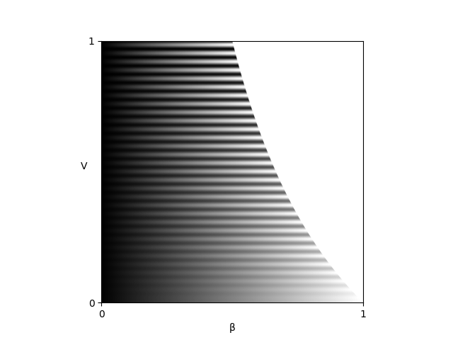

# Fringes
Author: Christian Kludt


## Description
This package provides the handy `Fringes` class which handles all the required parameters
for configuring fringe pattern sequences
and provides methods for fringe analysis.
<!---
link to  paper, please cite
--->

### Features

- Generalized Temporal Phase Unwrappting (GTPU)
- Noise model and Uncertainty Propagation
- Optimal Coding Strategy
- Deinterlacing
- Multiplexing
- Filtering Phase Maps
- Remapping

### Background
Many applications, such as fringe projection [[1]](#1) or fringe reflection (deflectometry) [[2]](#2),
require the ability to encode positional data.
To do this, sinusoidal fringe patterns are used to encode the position on the screen (in pixel coordinates)
at which the camera pixels were looking at during acquisition.

\
Figure 1: Phase Shifting Coding Scheme.

- #### Encoding
  - #### Spatial Modulation
    The x- resp. y-coordinate `ξ` of the screen is normalized into the range `[0, 1)`
by dividing through the maximum coordinate `L`\
<code> x = ξ/L &isin; [0, 1)</code>\
and used to modulate the radiance in a sinusoidal fringe pattern `I`
with offset `A`, amplitude `B` and spatial frequency `v`.
An additional phase offset `φ₀` may be set, e.g. to let the fringe patterns start with a gray value of zero.\
`I = A + B * cos(2πvx - φ₀)`
  - #### Temporal Modulation
    The pattern is then shifted `N` times with an equidistant phase shift of `2πf/N` radian each:\
`t = n / N` with <code>n &isin; {0, 1, ..., N - 1} &isin; &#8469;</code>\
`I = A + B * cos(2πvx - 2πft - φ₀)`
- #### Decoding
  - #### Temporal Demodulation
    From these shifts, the phase map `φ` is determined [[3]](#3). Due to the trigonometric functions used,
the global phase `Φ` is wrapped into the interval <code>[0, 2 &pi;]</code> with `v` periods:\
<code>φ &equiv; Φ mod 2&pi;</code> with `Φ = kx - φ₀`.
  - #### Spatial Demodulation (Phase Unwrapping)
    If only one set with spatial frequency <code>v &le; 1</code> is used,
no unwrapping is required because one period covers the complete coding range.
Hence, the coordinate `ξ` is computed directly by scaling: <code>ξ = φ / (2&pi;) * L / v</code>.
This constitutes the registration, which is a mapping in the same pixel grid as the camera sensor
and contains the information where each camera pixel, i.e. each camera sightray, was looking at
during the fringe pattern acquisition.
Note that in contrast to binary coding schemes, e.g. Gray code,
the coordinate is obtained with sub-pixel precision.
    - #### Temporal Phase Unwrapping (TPU)
        If multiple sets with different spatial frequencies `v` are used
and the unambiguous measurement range is larger than the coding range, i.e. <code>UMR &ge; L</code>,
the ambiguity of the phase map is resolved by
generalized multi-frequency temporal phase unwrapping (GTPU).
    - #### Spatial Phase Unwrapping (SPU)
        However, if only one set with `v > 1` is used, or multiple sets but  `UMR < L`, the ambiguous phase `φ`
is unwrapped analyzing the neighbouring phase values [[4]](#4), [[5]](#5).
This only yields a relative phase map, therefore absolute positions are unknown.
    - #### Single Sideband Demodulation
        If only one frame with `v >> 1` is used,
[[6]](#6)
the pattern is Fourier-transformed and processed in its spatial frequency domain as well as in its space-signal domain.
There is no requirement for unwrapping, because 
Again, this only yields a relative phase map, therefore absolute positions are unknown.

In an alternative formulation, the absolute quantities offset `A` and amplitude `B`
are replaced by the maximal possible gray value `Imax`
and the relative quantities exposure (relative average intensity) `β` and visibilty (relative fringe contrast) `V`
[[7]](#7):

```
I = A + B * cos(Φ) = Imax * β * (1 + V * cos(Φ))
```

The two parameters `β` and `V` describe the phase shifting signal `I`
independently of the value range of the light source or camera.
Both lie within the interval `[0, 1]` with the additional condition <code>β &le; 1 / (1 + V)</code>;
else, the radiance of the light source would be higher than the maximal possible value `Imax`.
Therefore, the valid values are limited for <code>β &ge; 0.5 </code>.
The optimal fringe contrast is achieved for `β = 0.5` and `V = 1`. 

\
Figure 2: Fringe pattern as a function of `β` and `V`.

The advantage of this representation is the normalization of the descriptive parameters `β` and `V`
and thereby the separation of additive and multiplicative influences.

The exposure `β` is affected by additional, constant light (not modulating the signal):
- the maximum brightness of the light source,
- the exposure time and the aperture setting of the camera,
- the absorption of optical elements (e.g. filters).

The visibility `V` of the fringes is influenced by:
- the maximum contrast of the light source,
- the modulation transfer function of the optical elements (e.g. the scattering characteristics of the test object),
- the depth of field and defocus,
- the resolution of the camera
(the camera pixel size projected onto the light source acts as a low pass filter, reducing the modulation of the signal).

## Contents
- [Installation](#installation)
- [Usage](#usage)
- [Graphical User Interface](#graphical-user-interface)
- [Optimal Coding Strategy](#optimal-coding-strategy)
- [Troubleshooting](#troubleshooting)
- [License](#license)
- [Project Status](#project-status)
- [References](#references)

## Installation
You can install `fringes` directly from [PyPi](https://pypi.org/) via `pip`:

```
pip install fringes
```

## Usage
You instantiate, parameterize and deploy the `Fringes` class:

```python
import fringes as frng      # import module

f = frng.Fringes()          # instantiate class
f.logger.setLevel("DEBUG")  # set logging level

f.glossary                  # get glossary
f.X = 1920                  # set width of the fringe patterns
f.Y = 1080                  # set height of the fringe patterns
f.K = 2                     # set number of sets
f.N = 4                     # set number of shifts
f.v = [9, 10]               # set spatial frequencies
f.T                         # get number of frames
                            
I = f.encode()              # encode fringe patterns
A, B, xi = f.decode(I)      # decode fringe patterns
```

You can change the [logging level](https://docs.python.org/3/library/logging.html#levels) of a `Fringes` instance.
For example, changing it to `'DEBUG'` gives you verbose feedback on which parameters are changed
and how long functions take to execute.

All parameters are accesible by the respective attributes of the `Fringes` class
(a glossary of them is obtained by the class attribute `glossary`).
They are implemented as class properties (managed attributes), which are parsed when setting,
so usually several input types are accepted
(e.g. `bool`, `int`, `float` for scalars
and additionally `list`, `tuple`, `ndarray` for arrays).
Note that some attributes have subdependencies (cf. Figure 3), hence dependent attributes might change as well.
Circular dependencies are resolved automatically.

For creating the fringe pattern sequence `I`, use the method `encode()`.
It will return a [NumPy array](https://numpy.org/doc/stable/reference/generated/numpy.ndarray.html) 
in videoshape (frames `T`, width `X`, height `Y`, color channels `C`).

For analyzing (recorded) fringe patterns, use the method `decode()`.
It will return a [namedtuple](https://docs.python.org/3/library/collections.html#collections.namedtuple), 
containing the Numpy arrays brightness `A`, modulation `B` and the coordinate `ξ`,
all in videoshape.

\
Figure 3: Parameter and their Interdependencies.

Each set (cf. frames in middle column in Figure 1)
consists of the following attributes (cf. black box in Figure 3):
- `N`: number of shifts
- `l`: wavelength [px]
- `v`: spatial frequency, i.e. number of periods (per screen length `L`)
- `f`: temporal frequency, i.e. number of periods to shift over

Each is an array with shape (number of directions `D`, number of sets `K`).\
For example, if <code>N.shape &equiv; (2, 3)</code>, it means that we encode `D = 2` directions with `K = 3` sets each.

Changing `D` or `K` directly, changes the shape of all set attributes.\
When setting a set attribute with a new shape (`D'`, `K'`),
`D` and `K` are updated as well as the shape of the other set attributes.\
If a set attribute is 1D, then it is stacked to match the number of directions `D`.\
If a set attribute is 0D i.e. a scalar, then all values are simply replaced by the new one.

`l` and `v` are related by `l = L / v`.
When `L` changes, `v` is kept constant and only `l` is changed.

## Graphical User Interface
Do you need a GUI? `Fringes` has a sister project that is called `Fringes-GUI`: https://pypi.org/project/fringes-gui/

## __Quality Metrics__
`UMR` denotes the unambiguous measurement range.
The coding is only unique within the interval `[0, UMR)`; after that it repeats itself.
The `UMR` is derived from `l` and `v`:
- If <code>l &isin; &#8469;</code>, <code>UMR = lcm(l<sub>i</sub>)</code> with `lcm` being the least common multiple.
- Else, if <code>v &isin; &#8469;</code>,
  <code>UMR = `L`/ gcd(v<sub>i</sub>)</code> with `gcd` being the greatest common divisor.
- Else, if <code>l &and; v &isin; &#8474;</code>, `lcm` resp. `gcd` are extended to rational numbers.
- Else, if <code>l &and; v &isin; &#8477; \ &#8474;</code>, `l` and `v` are approximated by rational numbers
  with a fixed length of decimal digits.

`eta` denotes the coding efficiency `L / UMR`. It makes no sense to choose `UMR` much larger than `L`,
because then a significant part of the coding range is not used.

`u` denotes the minimum possible uncertainty of the measurement in pixels.
It is based on the phase noise model from [[8]](#8)
and propagated through the unwrapping process and the phase fusion.
It is influenced by the fringe attributes
- `M`: number of averaged intensity samples,
- `N`: number of phase shifts,
- `l`: wavelengths of the fringes,
- `B`: measured amplitude

and the measurement hardware-specific noise sources [[9]](#9), [[10]](#10)
- `quant`: quantization noise of the light source or camera,
- `dark`: dark noise of the used camera,
- `shot`: photon noise of light itself,
- `gain`: system gain of the used camera.

`DR = UMR / u` is the dynamic range of the phase shift coding
and is a measure of how many points can be distinguished within the unambiguous measurement range `[0, UMR)`.
It remains constant if `L` and hence `l` are scaled (the scaling factor cancels out).

`SNR = L / u` is the signal-to-noise ratio of the phase shift coding
and is a masure of how many points can be distinguished within the screen length `[0, L)`.
Again, it remains constant if `L` and hence `l` are scaled (the scaling factor cancels out).

## __Optimal Coding Strategy__
As makes sense intuitively, more sets `K` as well as more shifts `N` per set reduce the uncertainty `u` after decoding.
A minimum of 3 shifts is needed to solve for the 3 unknowns brightness `A`, modulation `B` and coordinate `ξ`.
Any additional 2 shifts compensate for one harmonic of the recorded fringe pattern.
Therefore, higher accuracy can be achieved using more shifts `N`, but the time required to capture them 
sets a practical upper limit to the feasible number of shifts.

Generally, shorter wavelengths `l` (or equivalently more periods `v`) reduce the uncertainty `u`,
but the resolution of the camera and the display must resolve the fringe pattern spatially.
Hence, the used hardware imposes a lower bound for the wavelength (or upper bound for the number of periods).
   
Also, small wavelengths might result in a smaller unambiguous measurement range `UMR`.
If two or more sets `K` are used and their wavelengths `l` resp. number of periods `v` are relative primes,
the unambiguous measurement range can be increased many times.
As a consequence, one can use much smaller wavelenghts `l` (larger number of periods `v`).


However, it must be assured that the unambiguous measurment range is always equal or larger than both,
the width `X` and the height `Y`.
Else, [temporal phase unwrapping](#temporal-phase-unwrapping--tpu-) would yield wrong results and thus instead
[spatial phase unwrapping](#spatial-phase-unwrapping--spu-) is used.
Be aware that in the latter case only a relative phase map is obtained,
which lacks the information of where exactly the camera pixels were imaged to during acquisition.

To simplify finding and setting the optimal parameters, one can choose from the followng options:
- `v` can be set to `'optimal'`.
  This automatically determines the optimal integer set of `v`,
  based on the maximal resolvable spatial frequency `vmax`.\
- Equivalently, `l` can also be set to `'optimal'`.
  This will automatically determine the optimal integer set of `l`,
  based on the minimal resolvable wavelength `lmin = L / vmax`.
- `T` can be set directly, based on the desired acquisition time.
  The optimal `K`, `N` and  - if necessary - the multiplexing methods will be determined automatically.
- Instead of the options above, one can simply use the function `optimize()`
  to automatically set the optimal `v`, `l`, `T` and multiplexing methods.

However, those methods only perform optimally if the recorded modulation `B` is known for each chosen `v` or `l`.
This can be achieved by recording the **modulation transfer function** at a given number of sample points:
1. Set `K` to the required number of sample ponts (usually 10 is a good value).
2. Set `v` to `'exponential'`.
   This will create spatial frequencies `v` spaced evenly on a log scale (a geometric progression),
   starting from `0` up to `vmax`.
3. Ensure that the screen covers the complete field of view of the camera.
4. Encode, acquire and decode the fringe pattern sequence.
4. Call the method `setMTF` with the estimated modulation `B` from the measurement.
5. 
- `mtf2vmax()`: The optimal `vmax` is determined automatically by measuring the **modulation transfer function** `MTF`.\
  Therefore, a sequence of exponentially increasing `v` is acquired:
    3. Call the function `mtf2vmax(B)` with the argument `B` from decoding.

## Troubleshooting
<!---
- __`poetry install` does not work__  
  First, ensure that poetry is installed correctly as descibed on the [Poetry Website](https://python-poetry.org/docs/).\
  Secondly, ensure the correct python version is installed on your system, as specified in the file `pyproject.toml`!\
  Thirdly, this can be caused by a proxy which `pip` does not handle correctly.
  Manually setting the proxy in the Windows settings or even adding a system variable 
  `https_proxy = http://YOUR_PROXY:PORT` can resolve this.
--->

- __Decoding takes a long time__  
  This is probably related to the just-in-time compiler [Numba](https://numba.pydata.org/) 
  used for this computationally expensive function:
  During the first execution, an initial compilation is executed. 
  This can take several tens of seconds up to single digit minutes, depending on your CPU.
  However, for any subsequent execution, the compiled code is cached and the code of the function runs much faster, 
  approaching the speeds of code written in C.


- __My decoded coordinates show lots of noise__
  - Make sure the exposure of your camera is adjusted so that the fringe patterns show up with maximum contrast.
    Try to avoid under- and overexposure during acquisition.
  - Try using more, sets `K` and/or shifts `N`.
  - Adjust the used wavelengths `l` resp. number of periods `v` to ensure the unamboguous measurement range
    is larger than the pattern length, i.e. <code>UMR &ge; L</code>.
  - If the decoded modulation is much lower than the decoded brightness,
    try to use larger wavelengths `l` resp. smaller number of periods `v`.\
    If the decoded modulation remains low even with very large wavelengths (less than five periods per screen length),
    and you are conducting a deflectometric mesurement, the surface under test is probably too rough.
    Since deflectometry is for specular and glossy surfaces only, it isn't suited for scattering ones.
    You should consider a different measurement technique, e.g. fringe projection.

- __My decoded coordinates show systematic offsets__
  - First, ensure that the correct frames were captured while acquiring the fringe pattern sequence.
    If the timings are not set correctly, the sequence may be a frame off.
  - Secondly, this might occur if either the camera or the display used have a gamma value very different from 1.
    - Typically, screens have a gamma value of 2.2; therefore compensate by setting the inverse value
      <code>gamma<sup>-1</sup> = 1 / 2.2 &approx; 0.45</code> to the `gamma` attribute of the `Fringes` instance.\
      Alternatively, change the gamma value of the light source or camera directly.
    - You can use the static method `gamma_auto_correct` to
      automatically estimate and apply the gamma correction factor to linearize the display/camera response curve.
    - You might also use more shifts `N` to compensate for the dominant harmonics of the gamma-nonlinearities.

## License
Creative Commons Attribution-NonCommercial-ShareAlike 4.0 International Public License

## Project Status
This package is under active development, so features and functionally will be added in the future.
Feature requests are warmly welcomed!

## References
<a id="1">[1]</a>
[Burke et al.,
“Reverse engineering by fringe projection,”
Interferometry XI: Applications,
2002.](https://doi.org/10.1117/12.473547)

<a id="2">[2]</a>
[Burke et al.,
"Deflectometry for specular surfaces: an overview",
Advanced Optical Technologies,
2023.](https://doi.org/10.3389/aot.2023.1237687)

<a id="3">[3]</a>
[Burke,
"Phase Decoding and Reconstruction",
Optical Methods for Solid Mechanics: A Full-Field Approach,
2012.](https://www.wiley.com/en-us/Optical+Methods+for+Solid+Mechanics%3A+A+Full+Field+Approach-p-9783527411115)

<a id="4">[4]</a>
[Herráez et al.,
"Fast two-dimensional phase-unwrapping algorithm based on sorting by reliability following a noncontinuous path",
Appl. Opt.,
2002.](https://doi.org/10.1364/AO.41.007437)

<a id="5">[5]</a>
[Lei et al.,
"A novel algorithm based on histogram processing of reliability for two-dimensional phase unwrapping",
Optik - International Journal for Light and Electron Optics,
2015.](https://doi.org/10.1016/j.ijleo.2015.04.070)

<a id="6">[6]</a>
[Takeda et al.,
"Fourier-transform method of fringe-pattern analysis for computer-based topography and interferometry",
Journal of the Optical Society of America,
1982.](https://doi.org/10.1364/JOSA.72.000156)

<a id="7">[7]</a>
[Fischer et al.,
"Vorhersage des Phasenrauschens in optischen Messsystemen mit strukturierter Beleuchtung",
Technisches Messen,
2012.](https://doi.org/10.1524/teme.2012.0256)

<a id="8">[8]</a>
[Surrel,
"Additive noise effect in digital phase detection",
Applied Optics,
1997.](https://doi.org/10.1364/AO.36.000271)

<a id="9">[9]</a>
[EMVA,
"Standard for Characterization of Image Sensors and Cameras Release 4.0 Linear",
European Machine Vision Association,
2021.](https://www.emva.org/standards-technology/emva-1288/emva-standard-1288-downloads-2/)

<a id="10">[10]</a>
[Bothe,
"Grundlegende Untersuchungen zur Formerfassung mit einem neuartigen Prinzip der Streifenprojektion und Realisierung in einer kompakten 3D-Kamera",
Dissertation,
ISBN 978-3-933762-24-5,
BIAS Bremen,
2008.](https://www.amazon.de/Grundlegende-Untersuchungen-Formerfassung-Streifenprojektion-Strahltechnik/dp/3933762243/ref=sr_1_2?qid=1691575452&refinements=p_27%3AThorsten+B%C3%B6th&s=books&sr=1-2)

<!---
<a id="8">[8]</a>
[Park,
"A two dimensional phase-shifting method for deflectometry",
International Symposium on Optomechatronic Technologies,
2008.](https://doi.org/10.1117/12.816472)

<a id="9">[9]</a>
[Huang,
"Color-encoded digital fringe projection technique for high-speed three-dimensional surface contouring",
Optical Engineering,
1999.](https://doi.org/10.1117/1.602151)

<a id="10">[10]</a>
[Trumper et al.,
"Instantaneous phase shifting deflectometry",
Optics Express,
2016.](10.1364/OE.24.027993)

<a id="11">[11]</a>
[Liu et al.,
"Dual-frequency pattern scheme for high-speed 3-D shape measurement",
Optics Express,
2010.](https://doi.org/10.1364/OE.18.005229)

<a id="12">[12]</a>
[Liu et al.,
"Fast and accurate deflectometry with crossed fringes",
Advanced Optical Technologies,
2014.](10.1515/aot-2014-0032)

<a id="13">[13]</a>
[Kludt and Burke,
"Coding strategies for static patterns suitable for UV deflectometry",
Forum Bildverarbeitung 2018,
2018.](https://publikationen.bibliothek.kit.edu/1000088264)

#### [19] Inverse Laplace Filter
--->
