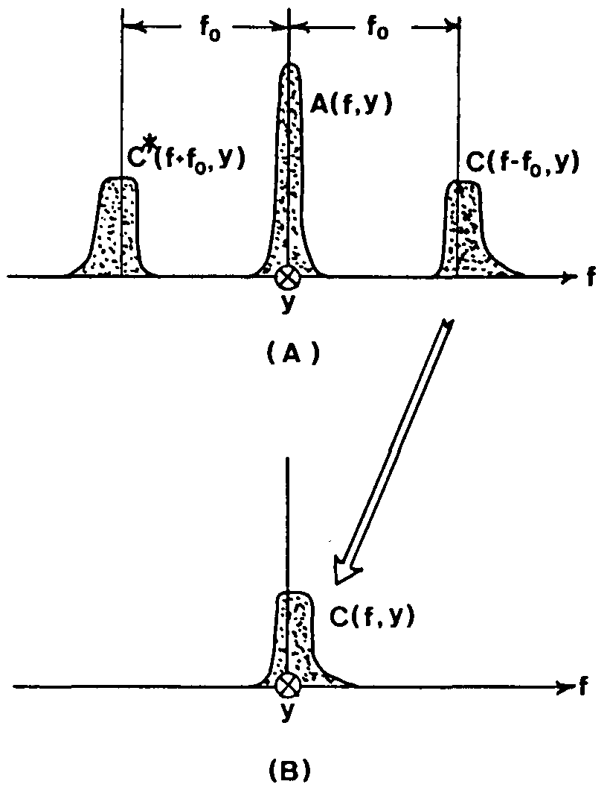

.. default-role:: math

Multiplexing
============
.. "Display lag is a phenomenon associated with most types of liquid crystal displays (LCDs)
   like smartphones and computers and nearly all types of high-definition televisions (HDTVs).
   It refers to latency, or lag between when the signal is sent to the display
   and when the display starts to show that signal.
   [...]
   Display lag is not to be confused with pixel response time,
   which is the amount of time it takes for a pixel to change from one brightness value to another.
   Currently the majority of manufacturers quote the pixel response time, but neglect to report display lag." [11]_

   The display lag is typically between 100ms - 200ms for commercially available LCD displays;
   the exposure time of the camera is typically set around 50ms.
   Hence, to acquire the complete fringe pattern sequence, it takes around 4s.
   Added to this is the image processing time, which is typically in the order of 1s.

   However, in a production line, cycle times of typically 1s are desired.

Multiplexing can be used to reduce the number of frames `T`.
This accelerates the acquisition time
at the cost of increased measurement uncertainty.

Spatial Division Multiplexing
-----------------------------
In spatial division multiplexing (SDM) [1]_, the fringes for each direction are additively superimposed,
which results in crossed fringe patterns, cf. :numref:`SDM`.
The amplitude `B` is halved, i.e. for each direction only have the signal strength is available.
The number of frames `T` is halfed.

.. _SDM:

    Spatial division multiplexing (SDM).

In the decoding stage, the recorded fringe pattern sequence `I^*` is Fourier-transformed
and the directions are separated in frequency space.
Because this is done within the camera frame of reference,
the demultiplexed directions only correspond to the encoded ones when the camera and scree are well aligned,
i.e. they must face each other directly.
Otherwise, the decoded coordinate directions can not be assigned to the screen axes correctly.

Wavelength Divison Multiplexing
-------------------------------
In wavelength divison multiplexing (WDM) [2]_,
the shifts are multiplexed into the color channel,
resulting in an RGB fringe pattern, cf. :numref:`WDM`.
Therefore it is required that all shifts `N = 3`.
The number of frames `T` is cut into thirds.

.. _WDM:
.. figure:: WDM.png
    :scale: 20%
    :align: center

    Wavelength division multiplexing (WDM).

This works best when an RGB-prism-based camera is used,
because its spectral bands don't overlap and hence the RGB-channels can be separated sharply.
Additionally, a white balance has to be executed to ensure equal irradiance readings in all color channels.

Also, the effect of color absorption by the surface material cannot be neglected.
This means that the test object itself must not have any color.

Overall, less light is available per pixel because it is divided into the three color channels.
Therefore, it requires about 3 times the exposure time compared to grayscale patterns.

Spatial and wavelength division multiplexing can be used together [3]_.
If only one set `K=1` per direction is used, only one frame `T=1` is necessary, cf. :numref:`SDM+WDM`.
This allows single shot applications to be implemented.

.. _SDM+WDM:
.. figure:: SDM+WDM.png
    :scale: 20%
    :align: center

    Spatial and wavelength division multiplexing combined.

Frequency Division Multiplexing
-------------------------------
In frequency division multiplexing (FDM) [4]_:sup:`,` [5]_,
the directions `D` and the sets `K` are additively superimposed.
Hence, the amplitude `B` is reduced by a factor of `D * K`.
This results in crossed fringe patterns if we have `D = 2` directions, cf. :numref:`FDM-D` and :numref:`FDM-DK`.

.. _FDM-D:
.. figure:: FDM_D.png
    :scale: 20%
    :align: center

    Frequency division multiplexing (FDM).
    Two directions are superimposed.

.. _FDM-DK:
.. figure:: FDM_DK.png
    :scale: 20%
    :align: center

    Frequency division multiplexing (FDM).
    Two directions and two sets are superimposed.

Each set `k` per direction `d` receives an individual temporal frequency `f_{d,k}`,
which is used in :ref:`temporal demodulation <encoding>`
to distinguish the individual sets.
A minimal number of shifts
`N_{min} \ge \lceil 2 * f_{max} \rceil + 1`
is required to satisfy the sampling theorem.

If one wants a static pattern, i.e. one that remains congruent when shifted,
the spatial frequencies must be integers:
`\nu_i \in \mathbb{N}`,
must not share any common divisor except one:
`gcd(\nu_i) = 1`,
and the temporal frequencies must equal the spatial ones:
`\nu_i = f_i`.
With static/congruent patterns, one can realize phase shifting by moving printed patterns [6]_.

Fourier Transform Method
------------------------
If only a single frame is recorded using a crossed fringe pattern,
the phase signal introduced by the object's distortion of the fringe pattern
can be extracted with a purely spatial analysis by virtue of the Fourier-transform method (FTM) [7]_:

The recorded phase consists of a carrier with the spatial frequency `\nu_r`
(note that `\nu_r` denotes the spatial frequency in the recorded camera frame,
therefore `\nu` and `\nu_r` are related by the imaging of the optical system but not identical):
`\varPhi_r = \varPhi_c + \varPhi_s = 2 \pi \nu_r + \varPhi_s`.
If the offset `A`, the amplitude `B` and the signal phase `\varPhi_s` vary slowly
compared with the variation introduced by the spatial-carrier frequency `\nu_r`,
i.e. the surface is rather smooth and has no sharp edges,
and the spatial carrier frequency is high enough, i.e. `\nu_r >> 1`,
their spetra can be separated and therefore filtered in frequency space.

For this purpose, the recorded fringe pattern is Fourier transformed
by the use of the two-dimensional fast-Fourier-transform (2DFFT) algorithm - hence the name -
and processed in its spatial frequency domain.
Here, the Fourier spectra are separated by the carrier frequency `\nu_r`, as can be seen in :numref:`spectra`.
We filter out the background variation `A`, select either of the two spectra on the carrier,
and translate it by `\nu_r` on the frequency axis towards the origin.

.. _spectra:

    In this image, the spatial frequency `\nu_r` is denoted as `f_0`.
    (A) Separated Fourier spectra; (B) single spectrum selected and translated to the origin.
    From [8]_.

Again using the 2DFFT algorithm, we compute the inverse Fourier-transform.
Now we have the signal phase `\varPhi_s` in the imaginary part
completely separated from the unwanted amplitude variation `B` in the real part.
Subsequently, a spatial phase-unwrapping algorithm may be allpied to remove any remaining phase jumps.

This phase unwrapping method is not critical if the signal-to-noise ratio is higher than 10
and the gradients of the signal phase `\varPhi_s` are less than `\pi` per pixel.
This only yields a relative phase map, therefore absolute positions remain unknown.

.. .. [11] `Wikipedia contributors,
        "Display lag",
        Wikipedia,
        2024.
        <https://en.wikipedia.org/wiki/Display_lag>`_

.. [1] `Park,
        "A twodimensional phase-shifting method for deflectometry",
        International Symposium on Optomechatronic Technologies,
        2008.
        <https://doi.org/10.1117/12.816472>`_

.. [2] `Huang,
        "Color-encoded digital fringe projection technique for high-speed three-dimensional surface contouring",
        Optical Engineering,
        1999.
        <https://doi.org/10.1117/1.602151>`_

.. [3] `Trumper et al.,
        "Instantaneous phase shifting deflectometry",
        Optics Express,
        2016.
        <https://doi.org/10.1364/OE.24.027993>`_

.. [4] `Liu et al.,
        "Dual-frequency pattern scheme for high-speed 3-D shape measurement",
        Optics Express,
        2010.
        <https://doi.org/10.1364/OE.18.005229>`_

.. [5] `Liu et al.,
        "Fast and accurate deflectometry with crossed fringes",
        Advanced Optical Technologies,
        2014.
        <https://doi.org/10.1515/aot-2014-0032>`_

.. [6] `Kludt and Burke,
        "Coding strategies for static patterns suitable for UV deflectometry",
        Forum Bildverarbeitung 2018,
        2018.
        <https://publikationen.bibliothek.kit.edu/1000088264>`_

.. [7] `Takeda et al.,
        "Fourier-transform method of fringe-pattern analysis for computer-based topography and interferometry",
        Journal of the Optical Society of America,
        1982.
        <https://doi.org/10.1364/JOSA.72.000156>`_

.. [8] `Massig and Heppner,
        "Fringe-pattern analysis with high accuracy by use of the Fourier-transform method: theory and experimental tests",
        Applied Optics,
        2001.
        <https://doi.org/10.1364/AO.40.002081>`_
