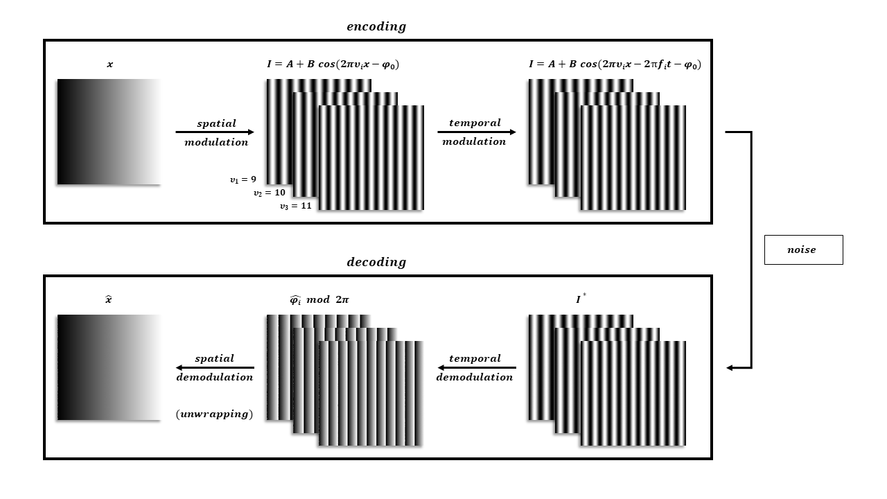

.. default-role:: math

Introduction
============

About
-----

Fringes is an easy to use, pure-python tool.
It provides the key functionality which is required in both, fringe projection and deflectometry:
positional coding by virtue of phase shifting.

Features
--------

- Generalized Temporal Phase Unwrapping (GTPU)
- Uncertainty Propagation
- Optimal Coding Strategy
- Multiplexing
- Filtering Phase Maps
- Remapping

Background
----------

Many applications, such as fringe projection [1]_ or fringe reflection (deflectometry) [2]_,
require the ability to encode positional data.
To do this, sinusoidal fringe patterns are used to encode the position on the screen (in pixel coordinates)
at which the camera pixels were looking at during acquisition.

In the following, the coding is considered for the horizontal direction only.
The procedure is analogous in the vertical direction.

    Phase Shift Coding Scheme

- Encoding
    #. Spatial Modulation

       `x = \xi / L`

       `I = A + B \cos(2 \pi \nu_i x - \varphi_0)`

       The x- resp. y-coordinate `\xi` of the screen is normalized into the range `x = [0, 1)`
       by dividing through the pattern length `L` and used to modulate the radiance in a sinusoidal fringe pattern `I`
       with offset `A`, amplitude `B` and spatial frequency `\nu`.
       An additional phase offset `\varphi_0` may be set to
       e.g. let the fringe patterns start (at the origin) with a gray value of zero.
       There can be `K` sets, i.e. `K` fringe patterns with different spatial frequencies `\nu_i`,
       with `i \in \{ \mathbb{N}_0 \enspace | \enspace i < K \}`.

    #.  Temporal Modulation

       `I = A + B \cos(2 \pi \nu_i x - 2 \pi f_i t_n - \varphi_0)`

       The patterns are then shifted `N_i` times with an equidistant phase shift of `2 \pi f_i / N_i`.
       This is equal to sampling over `f_i` periods with `N_i` sample points
       at time steps `t_n = n / N_i`, with `n \in \{ \mathbb{N}_0 \enspace | \enspace n < N_i \}`.

..
    - Transmission Channel
        - distortion
        - PSF -> MTF
        - camera noise

- Decoding
    #. Temporal Demodulation

       From these shifts, the phase maps `\varphi_i` are determined [3]_.
       Due to the trigonometric functions used, the global phase `\varPhi = 2 \pi \nu_i x - \varphi_0`
       is wrapped into the interval `[0, 2 \pi]` with `\nu_i` periods:
       `\varPhi \equiv \varphi_i \enspace mod \enspace 2 \pi`

       .. ξ ≡ λiϕi/(2π) mod λi

    #. Spatial Demodulation (Phase Unwrapping)

       To obtain the encoded coordinate `\xi`, three tasks must be executed:

       i   Undo the spatial modulation
           by finding the correct period order number
           `k_i \in \{ \mathbb{N}_0 \enspace | \enspace k_i < \lceil \nu_i \rceil \}` for each set `i`.
           The global phase is then estimated to be `\varPhi_i = k_i 2 \pi + \varphi_i`.
       ii  Recover the common independent variable `\xi_i`
           by linearly rescaling the global phase map:
           `\xi_i = \lambda_i \, \varPhi_i / (2 \pi)`,
           with `\lambda_i` being the spatial wavelength of the fringes (in pixels).
       iii Fuse the `K` coordinate maps
           by weighted averaging:
           `\xi = \sum_i w_i \xi_i \, / \, \sum_i w_i`.
           To obtain an optimal estimate, use inverse variance weighting,
           i.e. use the inverse variances of the coordinate maps as the weights for averaging:
           `w_i = 1 / \sigma_{\xi_i}^2`, with `\sigma_{\xi_i} \propto B_i / \nu_i / \sqrt{N_i}` [4]_.

           .. `\xi = \sum_{i=1}^K \xi_i w_i \enspace / \enspace \sum_{i=1}^K w_i`.

       This constitutes the registration, which is a mapping in the same pixel grid as the camera sensor
       and contains the information where each camera pixel, i.e. each camera sightray, was looking at
       during the fringe pattern acquisition.
       Note that in contrast to binary coding schemes, e.g. Gray code, the coordinate is obtained with sub-pixel precision.

       a) No Unwrapping

          If only one set `K = 1` with spatial frequency `\nu \le 1` is used, no unwrapping is required,
          because one period covers the complete coding range. In this case, only the scaling part (ii) has to be executed.

       b) Temporal Phase Unwrapping (TPU)

          If multiple sets with different spatial frequencies `\nu_i` are used,
          and the unambiguous measurement range is larger than the screen length `UMR > L`,
          the ambiguity of the phase map is resolved by generalized multi-frequency temporal phase unwrapping (GTPU).

       c) Spatial Phase Unwrapping (SPU)

          However, if only one set with `\nu > 1` is used, or multiple sets but `UMR < L`,
          the ambiguous phase `\varphi` is unwrapped by analyzing phase values in the spatial neighbourhood [5]_, [6]_.
          This only yields a relative phase map, therefore absolute positions are unknown.

       d) Fourier-transform Method (FTM)

          If only a single frame is recorded, the phase signal introduced by the object's distortion of the fringe pattern
          can be extracted with a purely spatial analysis by virtue of the Fourier-transform method [7]_, [8]_:
          The recorded phase consists of a carrier with the spatial frequency `\nu_r`
          (note that `\nu_r` denotes the spatial frequency in the recorded camera frame,
          therefore `\nu` and `\nu_r` are related by the imaging of the optical system but not identical):
          `\varPhi_r = \varPhi_c + \varPhi_s = 2 \pi \nu_r + \varPhi_s`.
          If the offset `A`, the amplitude `B` and the signal phase `\varPhi_s` vary slowly
          compared with the variation introduced by the spatial-carrier frequency `\nu_r`,
          i.e. the surface is rather smooth and has no sharp edges,
          and the spatial carrier frequency is high enough, i.e. `\nu_r >> 1`,
          their spetra can be separated and therefore filtered in frequency space.
          For this purpose, the recorded fringe pattern is Fourier transformed
          by the use of the two-dimensional fast-Fourier-transform (2DFFT) algorithm - hence the name -
          and processed in its spatial frequency domain.
          Here, the Fourier spectra are separated by the carrier frequency `\nu_r`, as can be seen in the next Figure.
          We filter out the background variation `A`, select either of the two spectra on the carrier,
          and translate it by `\nu_r` on the frequency axis toward the origin.
          Again using the 2DFFT algorithm, we compute the inverse Fourier-transform.
          Now we have the signal phase `\varPhi_s` in the imaginary part
          completely separated from the unwanted amplitude variation `B` in the real part.
          Subsequently, a spatial phase-unwrapping algorithm may be allpied to remove any remaining phase jumps.
          This phase unwrapping method is not critical if the signal-to-noise ratio is higher than 10
          and the gradients of the signal phase `\varPhi_s` are less than `\pi` per pixel.
          Again, this only yields a relative phase map, therefore absolute positions are unknown.

          .. figure:: FTM.png
              :scale: 25%
              :align: center
              :alt: mtf

              In this image, the spatial frequency `\nu_r` is denoted as `f_0`.
              (A) Separated Fourier spectra; (B) single spectrum selected and translated to the origin.
              From [7]_.

In an alternative formulation, the absolute quantities offset `A` and amplitude `B`
are replaced by the maximal possible gray value `I_{max}`,
the relative quantities exposure `\beta` (relative average intensity) and visibilty `V` (relative fringe contrast) [9]_:

`I = A + B \cos(\varPhi) = I_{max} \beta (1 + V \cos(\varPhi)`

The two parameters `\beta` and `V` describe the phase shifting signal `I`
independently of the value range of the light source or camera.
Both lie within the interval `[0, 1]` with the additional condition `\beta \le 1 / (1 + V)`;
else, the radiance of the light source would be higher than the maximal possible value `I_{max}`.
Therefore, the valid values of `V` are limited for `\beta > 0.5`.
The optimal fringe contrast is achieved for `\beta = 0.5` and `V = 1`.

.. figure:: codomain.png
    :scale: 75%
    :align: center
    :alt: coding-scheme

    Fringe pattern as a function of `\beta` and `V`.

The advantage of this representation is the normalization of the descriptive parameters `\beta` and `V`
and thereby the separation of additive and multiplicative influences.

The exposure `\beta` is affected by additional, constant light (not modulating the signal):

- the maximum brightness of the light source,
- the exposure time and the aperture setting of the camera,
- the absorption of optical elements (e.g. filters).

The visibility `V` of the fringes is influenced by:

- the maximum contrast of the light source,
- the modulation transfer function of the optical elements,
- the depth of field and defocus,
- the resolution of the camera
  (the camera pixel size projected onto the light source acts as a low pass filter,
  reducing the modulation of the signal).

.. [1] `Burke et al.,
        "Reverse engineering by fringe projection",
        Interferometry XI: Applications,
        2002.
        <https://doi.org/10.1117/12.473547>`_

.. [2] `Burke et al.,
        "Deflectometry for specular surfaces: an overview",
        Advanced Optical Technologies,
        2023.
        <https://doi.org/10.3389/aot.2023.1237687>`_

.. [3] `Burke,
        "Phase Decoding and Reconstruction",
        Optical Methods for Solid Mechanics: A Full-Field Approach,
        2012.
        <https://www.wiley.com/en-us/Optical+Methods+for+Solid+Mechanics%3A+A+Full+Field+Approach-p-9783527411115>`_

.. [4] `Surrel,
        "Additive noise effect in digital phase detection",
        Applied Optics,
        1997.
        <https://doi.org/10.1364/AO.36.000271>`_

.. [5] `Herráez et al.,
        "Fast two-dimensional phase-unwrapping algorithm based on sorting by reliability following a noncontinuous path",
        Applied Optics,
        2002.
        <https://doi.org/10.1364/AO.41.007437>`_

.. [6] `Lei et al.,
        "A novel algorithm based on histogram processing of reliability for two-dimensional phase unwrapping",
        Optik - International Journal for Light and Electron Optics,
        2015.
        <https://doi.org/10.1016/j.ijleo.2015.04.070>`_

.. [7] `Takeda et al.,
        "Fourier-transform method of fringe-pattern analysis for computer-based topography and interferometry",
        Journal of the Optical Society of America,
        1982.
        <https://doi.org/10.1364/JOSA.72.000156>`_

.. [8] `Massig and Heppner,
        "Fringe-pattern analysis with high accuracy by use of the Fourier-transform method: theory and experimental tests",
        Applied Optocs,
        2001.
        <https://doi.org/10.1364/AO.40.002081>`_

.. [9] `Fischer et al.,
        "Vorhersage des Phasenrauschens in optischen Messsystemen mit strukturierter Beleuchtung",
        Technisches Messen,
        2012.
        <https://doi.org/10.1524/teme.2012.0256>`_
