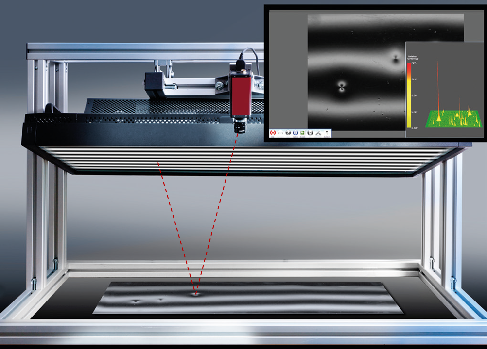
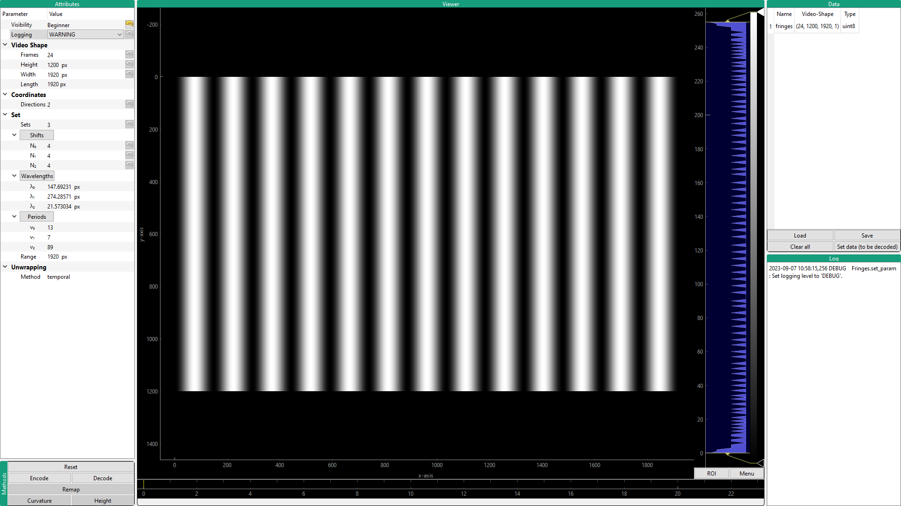

Usage
=====
This package provides the handy :class:`~fringes.fringes.Fringes` class,
which handles all the required parameters
for configuring fringe pattern sequences
and provides methods for creating and analyzing them.

Command-line
------------
You instantiate, parameterize and deploy the :class:`~fringes.fringes.Fringes` class:

.. code-block:: python

   from fringes import Fringes  # import the Fringes class

   f = Fringes()                # instantiate the Fringes class

All :ref:`parameters <parameters>` are accessible by the respective attributes
of the :class:`~fringes.fringes.Fringes` instance.
They are implemented as class `properties <https://docs.python.org/3/library/functions.html#property>`_
(managed attributes), which are parsed when setting,
so usually several input types are accepted
(e.g. ``bool``, ``int``, ``float`` for ``number``
and additionally ``list``, ``tuple``, ``numpy.ndarray`` for ``array``.).
Note that some attributes have sub-dependencies,
hence dependent attributes might change as well.
Circular dependencies are resolved automatically.

.. `list`, `tuple`, `ndarray` for `arrays <https://numpy.org/doc/stable/reference/generated/numpy.ndarray.html>`_).

.. code-block:: python

   f.X = 1920                   # set width of fringe patterns to screen width
   f.Y = 1080                   # set height of fringe patterns to screen height
   f.K = 2                      # set number of sets
   f.N = 4                      # set number of shifts
   f.v = [9, 10]                # set spatial frequencies

   T = f.T                      # get number of frames

For generating the fringe pattern sequence ``I``, use the method :meth:`~fringes.fringes.Fringes.encode`.
It returns a `Numpy array <https://numpy.org/doc/stable/reference/generated/numpy.ndarray.html>`_
in :attr:`video-shape <~fringes.vshape>` (frames :attr:`~fringes.fringes.Fringes.T`, width :attr:`~fringes.fringes.Fringes.X`,
height :attr:`~fringes.fringes.Fringes.Y`, color channels :attr:`~fringes.fringes.Fringes.C`).

.. code-block:: python

   I = f.encode()               # encode fringe patterns

Now display each frame of the fringe pattern sequence on a screen
and capture the scene with a camera
according to the following pseudocode (an elaborated example is given :ref:`below <minimal working example>`):

.. code-block:: python

   # allocate image stack
   I_rec = []

   for t in range(f.T):
       # display frame on screen
       frame = I[t]
       ...

       # capture scene with camera
       image = ...

       # append to image stack
       I_rec.append(image)

For analyzing (recorded) fringe patterns ``I_rec``, use the method :meth:`~fringes.fringes.Fringes.decode`.
It returns the Numpy arrays brightness ``a``, modulation ``b`` and coordinate ``x``.

.. code-block:: python

   a, b, x = f.decode(I_rec)    # decode fringe patterns

.. note::
  For the computationally expensive :meth:`~fringes.fringes.Fringes.encode`-function
  we make use of the just-in-time compiler `Numba <https://numba.pydata.org/>`_.
  During the first execution, an initial compilation is executed.
  This can take several tens of seconds up to single digit minutes, depending on your CPU and energy settings.
  However, for any subsequent execution, the compiled code is cached and the code of the function runs much faster,
  approaching the speeds of code written in C.

In your application, you can configure the
`logging <https://docs.python.org/3/howto/logging.html#advanced-logging-tutorial>`_
of the ``fringes`` package like so:

.. code-block:: python

   import logging

   formatter = logging.Formatter("%(asctime)s %(levelname)s %(name)s.%(funcName)s(): %(message)s")
   handler = logging.StreamHandler()
   handler.setFormatter(formatter)
   logger = logging.getLogger("fringes")
   logger.addHandler(handler)
   logger.setLevel("INFO")

Minimal Working Example
-----------------------

The only hardware you need is a screen and a camera, cf. :numref:`setup`.

.. _setup:

    Measurement setup for deflectometric inspection. From [1]_.

However, the setup can be as simple as only using your laptop's screen and integrated camera, cf. :numref:`laptop`

.. _laptop:
.. figure:: laptop.png
    :align: center
    :scale: 50%
    :alt: laptop

    Measurement setup.

Make sure the reflected fringe pattern is visible by the camera.
Also, make sure to focus onto the test object and adjust the exposure settings of the camera.
Then you can use the following code snipped to record and analyze your own dataset:

.. literalinclude:: /../../examples/record.py
   :language: python
   :linenos:

If the results look strange or wrong, please check out the :ref:`troubleshooting <troubleshooting>`.

Graphical User Interface
------------------------
Do you prefer to interact with a GUI?
`Fringes` has a sister project which is called `Fringes-GUI`: https://pypi.org/project/fringes-gui/.

You can install `Fringes-GUI` directly from `PyPi <https://pypi.org/>`_ with ``pip``::

    pip install fringes-gui

Then you import the ``fringes-gui`` package and call the function :meth:`~!fringes_gui.__main__.run`.

.. code-block:: python

   import fringes_gui as fgui
   fgui.run()

Now the graphical user interface should appear:

    Screenshot of the GUI.

Attributes
""""""""""
The attribute widget is located in the top left corner.
It contains the parameter tree which contains all the :ref:`attributes <parameters>`
of the :class:`~fringes.fringes.Fringes` class.
If you select a parameter and hover over it, a tool tip will appear,
containing the docstring of the respective attribute of the :class:`~fringes.fringes.Fringes` class.

The attribute `Visibility` does not affect the functionality of the parameters
but is used by the GUI to decide which parameters to display based on the current visibility level.
The purpose is mainly to ensure that the GUI is not cluttered with information that is not
intended at the current visibility level. The following criteria have been used
for the assignment of the recommended visibility level:

- `Beginner` (default):

  Parameters that should be visible in all levels via the GUI.
  The number of parameters with `Beginner` level should be limited to all basic parameters
  so the GUI display is well-organized and easy to use.

- `Expert`:

  Parameters that require a more in-depth knowledge of the system functionality.
  This is the preferred visibility level for all advanced parameters.

- `Guru`:

  Advanced parameters that usually only people with a sound background in phase shifting can make good use of.

- `Experimental`:

  New features that have not been tested yet.
  The system might crash at some point.

Upon every parameter change, all parameters of the :class:`Fringes <fringes.fringes.Fringes>` instance are saved
to the config file `.fringes.yaml` in the user home directory.
When the GUI starts again, the previous parameters are loaded.
To avoid this, just delete the config file
or press the ``reset`` button in the `Methods`_ widget to restore the default parameters.

Methods
"""""""
In the bottem left corner you will find action buttons
for the associated methods of the :class:`~fringes.fringes.Fringes` class.
Alternatively, you can use the keyboard shortcuts which are displayed when you hover over them.
The buttons are only active if the necessary data is available, i.e. was encoded, decoded or loaded.

Viewer
""""""
In the center resides the viewer.
If float data is to be displayed, `nan` is replaced by zeros.

Data
""""
The data widget is located in the top right corner.
It lists the data which was encoded, decoded or loaded.

In order to keep the parameters in the :ref:`Parameter Tree <attributes>` consistent with the data,
once a `parameter <Attributes>`_ has changed, certain data will be removed
and also certain :ref:`buttons <methods>` will be deactivated.
Also, the data has to fit in order to be able to execute certain functions.
As a consequence, if you load data - e.g. the recorded fringe pattern sequence -
the first element of its :attr:`video-shape <~fringes.vshape>`
has to match the parameter :attr:`Frames <~fringes.fringes.Fringes.T>`
in order to be able to decode it.

To display any datum listed in the table in the `Viewer`_, simply select the name of it in the table.

Click the ``Load`` button to choose data or a config file to load.
With the ``Save`` button, all data including the parameters are saved to the selected directory.
Use the ``Clear all`` button to delete all data.

.. note::
   When data is loaded, it is automatically transformed into :attr:`video-shape <~fringes.vshape>`.

.. note::
   By default, the datum `fringes` is decoded.
   If you want to decode a datum with a different name (e.g. one that you just loaded),
   select its name in the table and click ``Set data (to be decoded)``.

Log
"""
The logging of the :class:`~fringes.fringes.Fringes` class is displayed here.
The logging level can be set in the :ref:`Parameter Tree <attributes>`.

.. [1] `Burke,
        "Brilliant Insights – Deflectometry for the inspection of (partially) specular surfaces",
        2024.
        <https://www.iosb.fraunhofer.de/content/dam/iosb/iosbtest/documents/kompetenzen/systemtechnik/MRD/leistungen/deflektometrie/Deflectometry_en.pdf>`_
