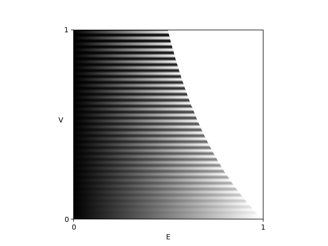

.. default-role:: math

Filter
======
The :ref:`decoding <decoding>` yields the following results:

The brightness `\hat{a}` is a measure for the reflectance (resp. absorption) of the surface.

The modulation `\hat{b}` is a measure for the glossiness (resp. scattering) of the surface.

The registration `\hat{x}` is a mapping from camera pixels to screen positions `\hat{x}`
(with subpixel accuracy).
It contains the information where each camera pixel, i.e. each camera sight ray,
looked onto the screen during the fringe pattern recording.

.. literalinclude:: /../../examples/decode.py
   :language: python
   :emphasize-lines: 11
   :linenos:

These results are in :ref:`video shape <video shape>`,
so for the brightness `\hat{a}` and the registration `\hat{x}`,
the usually two directions :attr:`~fringes.fringes.Fringes.D`
are along the the first i.e. the time axis.
For the modulation `\hat{b}`,
the modulation of the sets :attr:`~fringes.fringes.Fringes.K` of the directions :attr:`~fringes.fringes.Fringes.D`
are flattened into the first dimension;
you may reshape them as follows:

.. code-block:: python
   :linenos:
   :lineno-start: 25

   T, Y, X, C = b.shape
   b = b.reshape(f.D, f.K, Y, X, C)

.. figure:: filter/brightness.png
   :scale: 75%
   :align: center
   :alt: brightness

   Brightness.

.. figure:: filter/modulation.png
   :scale: 75%
   :align: center
   :alt: modulation

   Modulation.

.. figure:: filter/registration.png
   :scale: 75%
   :align: center
   :alt: registration

   Registration.

Direct and Global Illumination Component
----------------------------------------
The direct illumination component is just twice the measured modulation:

`I_D = 2 \hat{b}`.

The global illumination component can be determined with

`I_G = 2 (\hat{a} - \hat{b})`

under the condition that the spatial frequency `\nu` is high enough [Nay06]_.

Both can be normalized into the range [0, 1) by dividing through the maximal possible gray value `I_{max}`
of the recording camera.

.. literalinclude:: /../../examples/direct_global.py
   :language: python
   :emphasize-lines: 5, 9, 17, 18
   :linenos:

.. figure:: filter/direct.png
   :scale: 75%
   :align: center
   :alt: direct

   Direct illumination component.

.. figure:: filter/indirect.png
   :scale: 75%
   :align: center
   :alt: global

   Global illumination component.

Visibility and Exposure
-----------------------
In an alternative formulation,
the absolute quantities offset `a` and amplitude `b` of the phase shifting equation
are replaced by the maximal possible gray value `I_{max}`,
the relative quantities exposure `E` (relative average intensity) and visibilty `V` (relative fringe contrast) [Fis12]_:

`I = a + b \cos(\varPhi) = I_{max} E [1 + V \cos(\varPhi)]`

The two parameters `E = \hat{a} / I_{max}` and `V = \hat{b_i} / \hat{a}` describe the phase shifting signal `I`
independently of the value range `[0, I_{max}]` of the light source or camera.
Both lie within the interval `[0, 1]` with the additional condition `E \le 1 / (1 + V)`;
else, the radiance of the light source would be higher than the maximal possible value `I_{max}`.
Therefore, the valid values of `V` are limited for `E > 0.5`.
The optimal fringe contrast `V = 1` can be reached when `E = 0.5`.

.. _codomain:

    Fringe pattern as a function of `E` and `V`.

The advantage of this representation is the normalization of the descriptive parameters `E` and `V`
and thereby the separation of additive and multiplicative influences.

The exposure `E` is affected by additional, constant light (not modulating the signal):

- the maximum brightness of the light source,
- the absorption of the sample
- the absorption of optical elements (e.g. filters),
- the exposure time and the aperture setting of the camera.

The visibility `V` of the fringes is influenced by:

.. - the modulation transfer function of all system components

- the maximum contrast of the light source
- the :ref:`surface quality <psf>` of the sample (roughness, scattering),
- the position of the sample with regard to focal plane of the lens (defocus and depth of field),
- the camera lens' modulation transfer function,
- the camera's resolution (the camera pixel size projected onto the light source acts as a low pass filter).

.. literalinclude:: /../../examples/visibility_exposure.py
   :language: python
   :emphasize-lines: 4, 14, 15
   :linenos:

.. figure:: filter/visibility.png
   :scale: 75%
   :align: center
   :alt: visibility

   Visibility.

.. figure:: filter/exposure.png
   :scale: 75%
   :align: center
   :alt: exposure

   Exposure.

Verbose Results
---------------
Additionally to the already mentioned results brightness, modulation, registration,
visibility and exposure, more intermediate and verbose results an be returned
by setting the flag ``verbose`` in the method :meth:`~fringes.fringes.Fringes.decode` to ``True``:

.. literalinclude:: /../../examples/verbose.py
   :language: python
   :emphasize-lines: 12, 18, 19, 20, 21
   :linenos:

The phase ... after temporal demodulation ... link to fundamentals

.. figure:: filter/phase.png
   :scale: 75%
   :align: center
   :alt: phase

   Phase.

----

The fringe order ... spatial demodulation, i.e. unwrapping ... link to fundamentals

.. figure:: filter/fringe_order.png
   :scale: 75%
   :align: center
   :alt: fringe order

   Fringe order.

----

The residuals ... after optimization-based unwrapping ... link to fundamentals

.. figure:: filter/residuals.png
   :scale: 75%
   :align: center
   :alt: residuals

   Residuals.

----

The uncertainty ... after temporal demodulation i.e. unwrapping ...
best/minimal uncertainty if ui is set and correct fringe orders are found ... link to fundamentals

.. figure:: filter/uncertainty.png
   :scale: 75%
   :align: center
   :alt: uncertainty

   Uncertainty.

Slope
-----
If the deflectometric setup is calibrated,
the slope of the surface can be computed from the registration.

"[Deflectometry] measures slopes (first order derivatives of the shape).
The sensitivity to higher spatial frequencies is therefore amplified,
resulting in excellent (sometimes excessive) sensitivity for small-scale irregularities
and at the same time poor sensitivity and stability for low-order surface features." [Bur23]_

.. literalinclude:: /../../examples/slope.py
   :language: python
   :emphasize-lines: 14
   :linenos:

.. figure:: filter/slope_x.jpg
    :scale: 20%
    :align: center
    :alt: slope_x

    Slope map in x-direction.
    From [SAC]_.

.. figure:: filter/slope_y.jpg
    :scale: 20%
    :align: center
    :alt: slope_y

    Slope map in y-direction.
    From [SAC]_.

Curvature
---------
"As an alternative use of [deflectometry] data, one may differentiate them and recover surface curvatures
(combinations of second order shape derivatives [...].
Unlike point positions and slopes, the latter are intrinsic local characteristics of the surface [...]
that are independent of its embedding in 3D space.
As such, curvature maps are useful observables for various quality inspection tasks.
Derivation of curvatures is less error-prone than shape integration
and does not require accurate prior knowledge of the distance to the object." [Bur23]_

.. literalinclude:: /../../examples/curvature.py
   :language: python
   :emphasize-lines: 4, 14
   :linenos:

.. figure:: filter/curvature.jpg
    :scale: 20%
    :align: center
    :alt: curvature

    Curvature map.
    From [SAC]_.

.. Height
   ------
   Deflectometry measures slopes, therefore the 3D shape can in principle be reconstructed by integrating the slope data.
   From [Wag03]_:

   .. image:: integrate_01.png
       :scale: 100%
       :align: center
   .. image:: integrate_02.png
       :scale: 100%
       :align: center

   This is implemented as iterative local integration via an inverse laplace filter.
   However, the global height information is lost.
   Thus, it reveals only a relative height map.
   Think of it as a relief, where height is only relative to the local neighborhood.

   .. literalinclude:: /../../examples/height.py
      :language: python
      :emphasize-lines: 13, 15
      :linenos:

   .. figure:: filter/height.png
       :scale: 20%
       :align: center
       :alt: height

       Relative height map.

.. [Bur23]
   `Burke et al.,
   "Deflectometry for specular surfaces: an overview",
   Advanced Optical Technologies,
   2023.
   <https://doi.org/10.3389/aot.2023.1237687>`_

.. [Fis12]
   `Fischer et al.,
   "Vorhersage des Phasenrauschens in optischen Messsystemen mit strukturierter Beleuchtung",
   Technisches Messen,
   2012.
   <https://doi.org/10.1524/teme.2012.0256>`_

.. [Nay06]
   `Nayar et al.,
   "Fast separation of direct and global components of a scene using high frequency illumination",
   SIGGRAPH,
   2006.
   <https://dl.acm.org/doi/abs/10.1145/1179352.1141977>`_

.. [SAC]
   `SAC Sirius Advanced Cybernetics GmbH,
   "trevista",
   product information sheet,
   2018.
   <https://www.sac-vision.net/share/deutsch/prospekte/trevista4.pdf>`_

.. .. [Wag03]
      `Wagner,
      "Informationstheoretische Grenzen optischer 3D-Sensoren",
      Dissertation,
      2003.
      <https://d-nb.info/971814139/34>`_

      source of inverse laplace filter