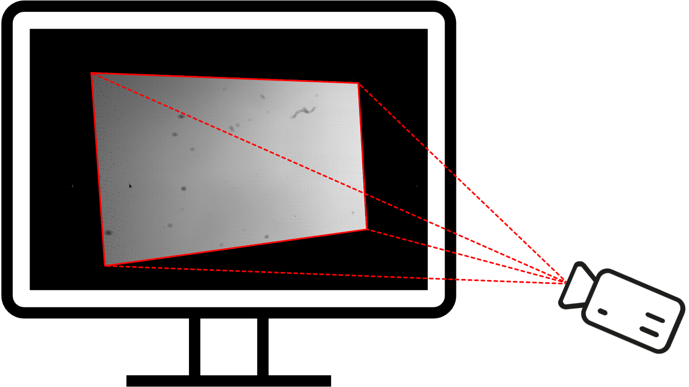

.. default-role:: math

Source
======
The registration (:ref:`decoded coordinates <decoding>`) `\boldsymbol{\Xi}` is a function

`\boldsymbol{\Xi} : \mathcal{C} \mapsto \mathcal{S} \cup \varnothing,
\quad \mathcal{C} \subseteq \mathbb{Z}^2,
\quad \mathcal{S} \subseteq \mathbb{R}^2`

defined over the two-dimensional set of all camera pixels `\mathcal{C}`
and yielding positions `\mathbf{\hat{x}}_\mathrm{s}` on the two-dimensional screen `\mathcal{S}`:

`\boldsymbol{\Xi}(\mathbf{x}_\mathrm{c}) = \mathbf{\hat{x}}_\mathrm{s},
\quad \text{with} \quad \mathbf{x}_\mathrm{c} =
\left(\begin{array}{c}
x_\mathrm{c} \\
y_\mathrm{c}
\end{array}\right),
\quad \mathbf{\hat{x}}_\mathrm{s} =
\left(\begin{array}{c}
x_\mathrm{s} \\
y_\mathrm{s}
\end{array}\right)`.

More pictorial, it contains the information where each camera sight ray was looking to:
where onto the screen or elsewhere.

Similarly, the mean modulation (signal strenth) `\boldsymbol{\bar{B}}` is a function

`\boldsymbol{\bar{B}} : \mathcal{C} \mapsto \mathcal{M},
\quad \mathcal{M} \subseteq \mathbb{R}`

defined over `\mathcal{C}` and yielding non-negative modulation values `\bar{b}_{_{\mathbf{x}_\mathrm{c}}}`
for every camera pixel `\mathbf{x}_\mathrm{c}`.

.. `\mathbf{B} : \mathcal{C} \mapsto \mathcal{M},
   \quad \mathcal{M} \subseteq \mathbb{R}_+^{2 \times K}`

   defined over `\mathcal{C}`
   and yielding `2 \times K`-channel, non-negative modulation values `\hat{b}`
   for every camera pixel `\mathbf{x}_\mathrm{c}`:

   `\mathbf{B}(\mathbf{x}_\mathrm{c}) =
   \left(\begin{array}{cccc}
   \hat{b}_{\mathrm{x},0} & \hat{b}_{\mathrm{x},1} & \cdots & \hat{b}_{\mathrm{x},K-1} \\
   \hat{b}_{\mathrm{y},0} & \hat{b}_{\mathrm{y},1} & \cdots & \hat{b}_{\mathrm{y},K-1}
   \end{array}\right)`.

   The channels of the modulation values are the coding direction `d \in \{ \mathrm{x}, \mathrm{y} \}`
   and the fringe pattern set `i \in \{ \, \mathbb{N}_0 \mid i < K \, \}`.
   The mean of every element of the modulation `\mathbf{B}` is denoted by

   `\bar{b}_{\mathbf{x}_\mathrm{c}}
   = \frac{\sum_{d, i \in \{ \mathrm{x}, \mathrm{y} \}, \{ \, \mathbb{N}_0 \mid i < K \, \}} \hat{b}_{d,i}}{2K}`.

To determine how much a screen pixel `\mathbf{x}_\mathrm{s}`
contributed to the exposure of the camera sensor `\mathcal{C}`,
we need the inverse function `\boldsymbol{\Xi}^{-1} : \mathcal{S} \mapsto \mathcal{C}`
to remap `\bar{b}_{_{\mathbf{x}_\mathrm{c}}}` from `\mathbf{x}_\mathrm{c}` to `\mathbf{x}_\mathrm{s}`
and accumulate it in the plane `\mathcal{S}`.
However, this presents an ill-posed problem for the following reasons:

1. `\boldsymbol{\Xi}^{-1}` is not well defined
   because there may be screen points `\mathbf{\hat{x}}_\mathrm{s}` where no camera sight ray is looking at,
   so that `\boldsymbol{\Xi}` is not surjective.

2. `\boldsymbol{\Xi}^{-1}` is not uniquely defined
   because there might be more than one camera sight ray looking at the same screen point `\mathbf{\hat{x}}_\mathrm{s}`,
   so that `\boldsymbol{\Xi}` is not injective.

3. `\boldsymbol{\Xi}^{-1}` is not continuous:
   although screen positions `\mathbf{\hat{x}}_\mathrm{s}` are decoded with continuous values,
   the screen itself can only be activated at discrete pixels

   `\mathbf{x}_\mathrm{s} =
   \left(\begin{array}{c}
   x_\mathrm{s} \\
   y_\mathrm{s}
   \end{array}\right),
   \quad \text{with} \quad \mathbf{x}_\mathrm{s} \in \tilde{\mathcal{S}} \subseteq \mathbb{Z}^2`.

.. 3. continuous ???

.. However, the inverse `\boldsymbol{\Xi}^{-1}` does not exist for the following reasons:

Because the registration `\mathbf{\Xi}` is neighter surjective nor injective,
it follows that it is not injective, hence it is not invertible.

A straight forward approxiation would be to compute the nearest integer screen pixel
`\mathbf{x}_\mathrm{s} = \lfloor \mathbf{\hat{x}}_\mathrm{s} \rceil`
and increment `\tilde{\mathcal{S}}` there by `\bar{b}_{_{\mathbf{x}_\mathrm{c}}}`.
However, this neglects the fact that the camera pixel `\mathbf{x}_\mathrm{c}`
projected onto the screen `\tilde{\mathcal{S}}`
is usually :ref:`blurred <blur>`, i.e. spread over several screen pixels.

As a regularization constraint we assume a certain smoothness:
Although the continuity assumption is not necessarily satisfied by every object,
and especially not if we place a microlens array in front of the screen to assemble a lightfield display,
we assume the inverse mapping `\boldsymbol{\Xi}^{-1}` can be represented as a piecewise-continuous function,
at least for local regions with the size of the camera sight ray's :ref:`point spread function <psf>`
with radius `R_{\mathbf{x}_\mathrm{c}}`.
With this regularization constraint, we assign an interpolated value `\tilde{b}_{\mathbf{x}_\mathrm{s}}`
to each screen pixel `\mathbf{x}_\mathrm{s}` as follows:

1. Denote by `d` the Euclidian distance between a screen pixel `\mathbf{x}_\mathrm{s}`
   and a decoded screen position `\mathbf{\hat{x}}_\mathrm{s}`:

   `d({\mathbf{x}_\mathrm{s}}, \mathbf{\hat{x}}_\mathrm{s})
   = \lVert \mathbf{x}_\mathrm{s} - \mathbf{\hat{x}}_\mathrm{s} \rVert`.

2. The set of all camera pixels `\mathbf{x}_\mathrm{c}`
   where `d` evaluates to zero is denoted by

   `\mathcal{C}^\mathrm{0}(\mathbf{x}_\mathrm{c})
   = \{ \mathbf{x}_\mathrm{c} \in \mathcal{C}, \mid d({\mathbf{x}_\mathrm{s}}, \mathbf{\hat{x}}_\mathrm{s}) = 0 \}`.

.. \quad \text{with} \quad \mathbf{\hat{x}}_\mathrm{s} = \boldsymbol{\Xi}(\mathbf{x}_\mathrm{c})`

3. Similarly, the set of all camera pixels `\mathbf{x}_\mathrm{c}`
   where `d` is within the radius `R_{\mathbf{x}_\mathrm{c}}` is denoted by

   `\mathcal{C}^\mathrm{R_{\mathbf{x}_\mathrm{c}}}(\mathbf{x}_\mathrm{c})
   = \{ \mathbf{x}_\mathrm{c} \in \mathcal{C} \mid 0 < d({\mathbf{x}_\mathrm{s}}, \mathbf{\hat{x}}_\mathrm{s}) \leq R_{\mathbf{x}_\mathrm{c}} \}`;

.. the distance `R_{\mathbf{x}_\mathrm{c}}` corresponds to the radius
   of the camera sight ray's :ref:`point spread function <psf>`.

4. We apply inverse distance weighting [She68]_ by virtue of the modified [Ren88]_ Shepard's method and use the weights

   `w_{_{\mathbf{x}_\mathrm{c}}}(\mathbf{x}_\mathrm{c}) =
   \begin{cases}
   d({\mathbf{x}_\mathrm{s}}, \mathbf{\hat{x}}_\mathrm{s})^{-2}, & \text{if} \quad d \leq R_{\mathbf{x}_\mathrm{c}}, \\
   0, & \text{otherwise}
   \end{cases}`

.. `w_{_{\mathbf{x}_\mathrm{c}}}(\mathbf{x}_\mathrm{c}) =
   \begin{cases}
   \frac{1}{d_{_{\mathbf{x}_\mathrm{c}}}^2(\mathbf{x}_\mathrm{c})}, & \text{if} \quad d \leq R_{\mathbf{x}_\mathrm{c}}, \\
   0, & \text{otherwise}
   \end{cases}`.

With this we compute the source activation heatmap
by setting the value of the screen pixel `\mathbf{x}_\mathrm{s}` to

a) the mean value of all mean modulation values
   where the distance evaluates to zero,

b) the inverse distance weighted mean of the mean modulation values
   where the distance is larger than zero but smaller than or equal to the radius `R_{\mathbf{x}_\mathrm{c}}`,

c) zero if no distance value is within the radius `R_{\mathbf{x}_\mathrm{c}}`:

.. todo: source contribution heatmap

`S^\mathrm{BF}(\mathbf{x}_\mathrm{s}) = \tilde{b}_{_{\mathbf{x}_\mathrm{s}}} =
\begin{cases}
\frac{\sum_{\mathbf{x}_\mathrm{c} \in \mathcal{C}^\mathrm{0}} \bar{b}_{_{\mathbf{x}_\mathrm{c}}}}{| \mathcal{C}^\mathrm{0} |},
& \text{if} \quad | \mathcal{C}^\mathrm{0} | > 0 \\
\frac{\sum_{\mathbf{x}_\mathrm{c} \in \mathcal{C}^\mathrm{R}} w_{_{\mathbf{x}_\mathrm{c}}} \bar{b}_{_{\mathbf{x}_\mathrm{c}}}}{\sum_{\mathbf{x}_\mathrm{c} \in \mathcal{C}^\mathrm{R}} w_{_{\mathbf{x}_\mathrm{c}}}}
& \text{if} \quad | \mathcal{C}^\mathrm{R} | > 0 \\
0, & \text{otherwise}
\end{cases}`

When using a *kd-tree* as a fast spatial search structure, this becomes an efficient interpolation method
with computational complexity `\mathcal{O}(| \tilde{\mathcal{S}} | \log(| \mathcal{C} |))`.

:numref:`source_map` depicts the normalized source activation heatmap:
a grid representing the screen (light source)
with the pixel values being a relative measure
of how much a screen pixel (point-like element of the light source) contributed
to the exposure of the camera sensor.

.. _source_map:

    Source activation heatmap `\mathbf{S}` shown on the screen.
    The right side in the camra field of view is brighter/stronger, because it is closer to the camera.
    Inside, several blurry (about a dozen dot-shaped and one S-shaped) structures are visible,
    which are dust and a lint on the camera lens.
    Because they absorbe light, the source activation heatmap there becomes darker/weaker.
    On the left side the mouse pointer is visible: It occluded the phase shifting sequence, so it is black.
    It is sharp because the camera was focused onto the screen.

.. In fact, this is the inverse operation of OpenCV's remap() [Ope]_
   and is based on an idea proposed in [Coc17]_.

One use case of this method is the determination of the bright field illumination:

`S^\mathrm{BF}(\mathbf{x}_\mathrm{s}) =
\begin{cases}
I_\mathrm{max}, & \text{if $S(\mathbf{x}_\mathrm{s}) > I_\mathrm{th}$} \\
0, & \text{otherwise}
\end{cases}`

where `I_\mathrm{max}` denotes the maximal value the screen `\tilde{\mathcal{S}}` can display
and `I_\mathrm{th}` denotes the global threshold.
The complement yields the darkfield illumination for the recorded scene:

`S^\mathrm{DF} = S \setminus S^\mathrm{BF}`

.. .. [Coc17]
      `Cochran,
      "Inverting a real-valued index grid",
      Stack Overflow,
      2017.
      <https://stackoverflow.com/questions/41703210/inverting-a-real-valued-index-grid/46009462#46009462>`_

.. .. [Klu23]
      `Kludt,
      "Object-specific light field illumination",
      Technisches Messen,
      2023.
      <>_`

.. .. [Ope]
      `OpenCV,
      "remap()",
      OpenCV,
      2024.
      <https://docs.opencv.org/4.9.0/da/d54/group__imgproc__transform.html#gab75ef31ce5cdfb5c44b6da5f3b908ea4>`_

.. [Ren88]
   `Renka,
   "Multivariate interpolation of large sets of scattered data",
   ACM Transactions on Mathematical Software,
   1988.
   <https://dl.acm.org/doi/10.1145/45054.45055>`_

.. [She68]
   `Shepard,
   "A two-dimensional interpolation function for irregularly-spaced data",
   ACM National Conference,
   1968.
   <http://dx.doi.org/10.1145/800186.810616>`_
