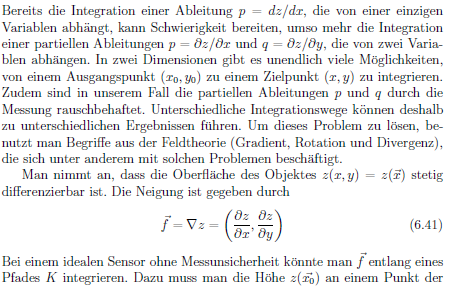
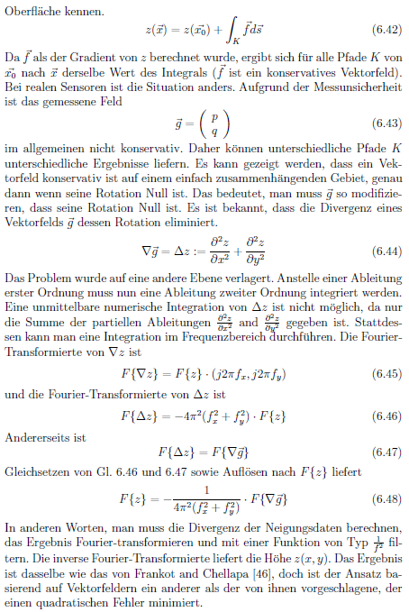

.. default-role:: math

Filter
======
The :ref:`decoding <decoding>` yields the following results:

The brightness `\hat{A}` is a measure for the reflectance (resp. absorption) of the surface.

The modulation `\hat{B_i}` is a measure for the glossiness (resp. scattering) of the surface.

The registration `\boldsymbol{\Xi}` is a mapping from camera pixels to screen positions (with subpixel accuracy).
It contains the information where each camera pixel, i.e. each camera sight ray,
looked onto the screen during the fringe pattern acquisition.

Direct and Global Illumination Component
----------------------------------------
The direct illumination component is just twice the measured modulation:

`I_D = 2 \hat{B}`.

The global illumination component can be determined with

`I_G = 2 (\hat{A} - \hat{B})`

under the condition that the spatial frequency `\nu` is high enough [1]_.

Both can be normalized into the range [0, 1) by dividing through the maximal possible gray value `I_{max}`.

Visibility and Exposure
-----------------------
In an alternative formulation,
the absolute quantities offset `A` and amplitude `B` of the phase shifting equation
are replaced by the maximal possible gray value `I_{max}`,
the relative quantities exposure `\beta` (relative average intensity) and visibilty `V` (relative fringe contrast) [2]_:

`I = A + B \cos(\varPhi) = I_{max} \beta [1 + V \cos(\varPhi)]`

The two parameters `\beta = \hat{A} / I_{max}` and `V = \hat{B_i} / \hat{A}` describe the phase shifting signal `I`
independently of the value range `[0, I_{max}]` of the light source or camera.
Both lie within the interval `[0, 1]` with the additional condition `\beta \le 1 / (1 + V)`;
else, the radiance of the light source would be higher than the maximal possible value `I_{max}`.
Therefore, the valid values of `V` are limited for `\beta > 0.5`.
The optimal fringe contrast `V = 1` can be reached when `\beta = 0.5`.

.. _codomain:
.. figure:: codomain.png
    :scale: 75%
    :align: center

    Fringe pattern as a function of `\beta` and `V`.

The advantage of this representation is the normalization of the descriptive parameters `\beta` and `V`
and thereby the separation of additive and multiplicative influences.

The exposure `\beta` is affected by additional, constant light (not modulating the signal):

- the maximum brightness of the light source,
- the absorption of the sample
- the absorption of optical elements (e.g. filters),
- the exposure time and the aperture setting of the camera.

The visibility `V` of the fringes is influenced by:

.. - the modulation transfer function of all system components

- the maximum contrast of the light source
- the :ref:`surface quality <psf>` of the sample (roughness, scattering),
- the position of the sample with regard to focal plane of the lens (defocus and depth of field),
- the camera lens' modulation transfer function,
- the camera's resolution (the camera pixel size projected onto the light source acts as a low pass filter).

.. .. figure:: visibility.png
    :scale: 75%
    :align: center

..     Visibility.

.. .. figure:: exposure.png
    :scale: 75%
    :align: center

..     Exposure.

Slope
--------------------
If the deflectometric setup is calibrated,
the slope of the surface can be computed from the registration.

"[Deflectometry] measures slopes (first order derivatives of the shape).
The sensitivity to higher spatial frequencies is therefore amplified,
resulting in excellent (sometimes excessive) sensitivity for small-scale irregularities
and at the same time poor sensitivity and stability for low-order surface features." [3]_

.. figure:: slope_x.jpg
    :scale: 20%
    :align: center

    Slope map in x-direction.
    From [4]_.

.. figure:: slope_y.jpg
    :scale: 20%
    :align: center

    Slope map in y-direction.
    From [4]_.

Curvature
---------
"As an alternative use of [deflectometry] data, one may differentiate them and recover surface curvatures
(combinations of second order shape derivatives [...].
Unlike point positions and slopes, the latter are intrinsic local characteristics of the surface [...]
that are independent of its embedding in 3D space.
As such, curvature maps are useful observables for various quality inspection tasks.
Derivation of curvatures is less error-prone than shape integration
and does not require accurate prior knowledge of the distance to the object." [3]_

.. figure:: curvature.jpg
    :scale: 20%
    :align: center

    Curvature map.
    From [4]_.

Height
------
Deflectometry measures slopes, therefore the 3D shape can in principle be reconstructed by integrating the slope data.
From [5]_:

|

This is implemented as iterative local integration via an inverse laplace filter.
However, the global height information is lost.
Thus, it reveals only a relative height map.
Think of it as a relief, where height is only relative to the local neighborhood.

.. [1] `Nayar et al.,
       "Fast separation of direct and global components of a scene using high frequency illumination",
       SIGGRAPH,
       2006.
       <https://dl.acm.org/doi/abs/10.1145/1179352.1141977>`_

.. [2] `Fischer et al.,
        "Vorhersage des Phasenrauschens in optischen Messsystemen mit strukturierter Beleuchtung",
        Technisches Messen,
        2012.
        <https://doi.org/10.1524/teme.2012.0256>`_

.. [3] `Burke et al.,
        "Deflectometry for specular surfaces: an overview",
        Advanced Optical Technologies,
        2023.
        <https://doi.org/10.3389/aot.2023.1237687>`_

.. [4] `SAC Sirius Advanced Cybernetics GmbH,
        "trevista",
        product information sheet,
        2018.
        <https://www.sac-vision.net/share/deutsch/prospekte/trevista4.pdf>`_

.. [5] `Wagner,
        "Informationstheoretische Grenzen optischer 3D-Sensoren",
        Dissertation,
        2003.
        <https://d-nb.info/971814139/34>`_
